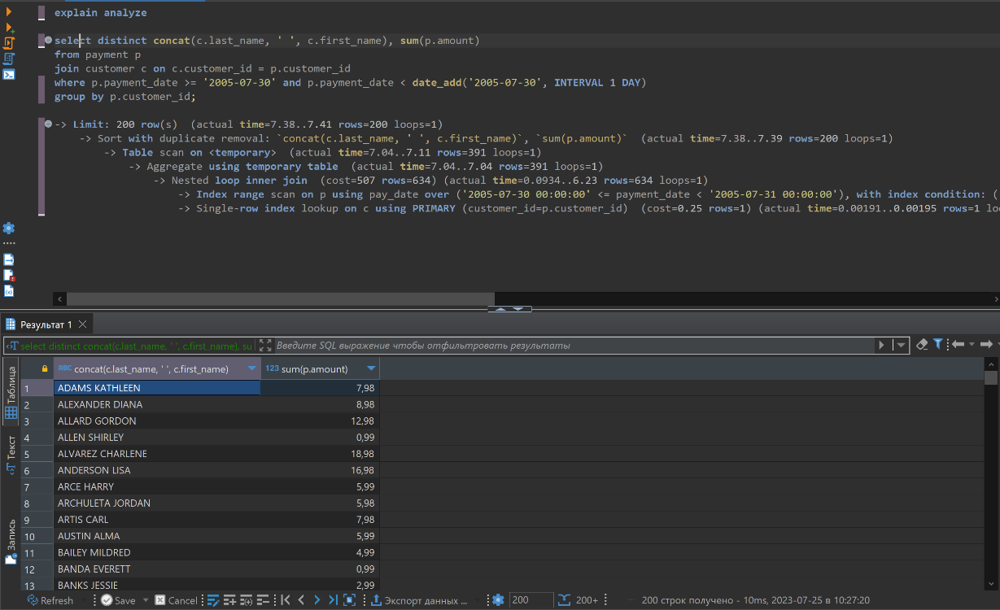

# Домашнее задание к занятию "Индексы" - `Мильдзихов Сергей`

### Задание 1

Напишите запрос к учебной базе данных, который вернёт процентное отношение общего размера всех индексов к общему размеру всех таблиц.

### Ответ

> select round (sum(index_length) / sum(data_length) * 100) as '% index'

> from INFORMATION_SCHEMA.TABLES;

### Задание 2

Выполните explain analyze следующего запроса:

перечислите узкие места; Избыточные запросы к таблицам, которые не нужны для получения этих данных, в оконной функции лишняя таблица, лишние условия.

оптимизируйте запрос: внесите корректировки по использованию операторов, при необходимости добавьте индексы.

### Ответ

`

explain analyze select distinct concat(c.last_name, ' ', c.first_name), sum(p.amount) from payment p join customer c on c.customer_id = p.customer_id where p.payment_date >= '2005-07-30' and p.payment_date < date_add('2005-07-30', INTERVAL 1 DAY) group by p.customer_id;

-> Limit: 200 row(s) (actual time=7.38..7.41 rows=200 loops=1) -> Sort with duplicate removal: concat(c.last_name, ' ', c.first_name), sum(p.amount) (actual time=7.38..7.39 rows=200 loops=1) -> Table scan on (actual time=7.04..7.11 rows=391 loops=1) -> Aggregate using temporary table (actual time=7.04..7.04 rows=391 loops=1) -> Nested loop inner join (cost=507 rows=634) (actual time=0.0934..6.23 rows=634 loops=1) -> Index range scan on p using pay_date over ('2005-07-30 00:00:00' <= payment_date < '2005-07-31 00:00:00'), with index condition: ((p.payment_date >= TIMESTAMP'2005-07-30 00:00:00') and (p.payment_date < (('2005-07-30' + interval 1 day)))) (cost=286 rows=634) (actual time=0.072..4.84 rows=634 loops=1) -> Single-row index lookup on c using PRIMARY (customer_id=p.customer_id) (cost=0.25 rows=1) (actual time=0.00191..0.00195 rows=1 loops=634)

